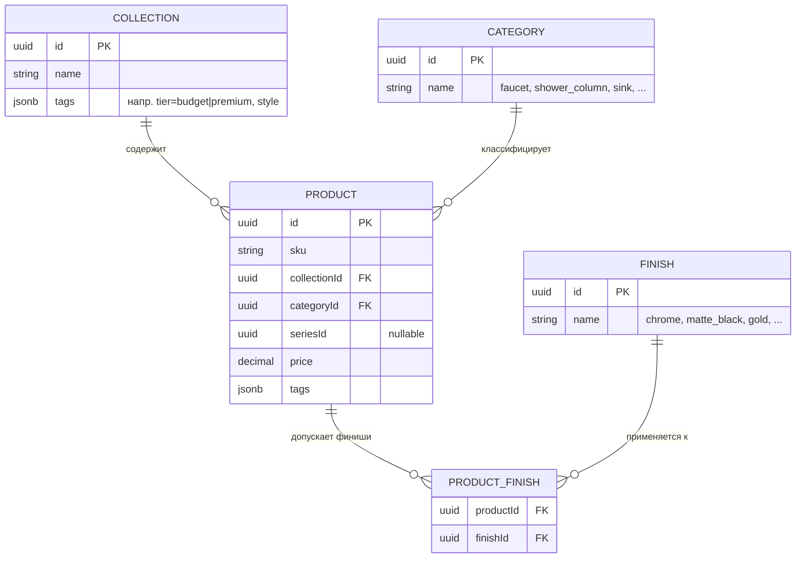
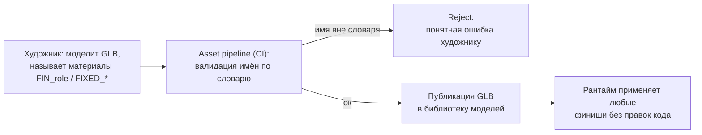

# Web-конфигуратор ванной комнаты (3D). Техническое проектирование

Дизайн-документ по тестовому заданию на позицию **Project Technical Lead**. Ниже — техническое проектирование двух подсистем 3D-конфигуратора: движка правил (Rules Engine) и системы материалов (финишей). Исходное ТЗ: [`docs/task.pdf`](docs/task.pdf).

**Формат:** дизайн-документ — схемы данных, JSON Schema, псевдокод, диаграммы. Реализация кода не входит в объём задания.

**Как читать:**
- [Допущения и рамки](#0-допущения-и-рамки) — решения, от которых зависит вся архитектура
- [Задача 1 — Rules Engine](#задача-1---rules-engine) — модель правил, механизм применения, разрешение конфликтов
- [Задача 2 — Система материалов](#задача-2---система-материалов-финиши) — каталог финишей, конвенция слотов, применение
- [Что я бы уточнил у клиента](#3-что-я-бы-уточнил-у-клиента) — открытые продуктовые вопросы

> Диаграммы (Mermaid) рендерятся прямо на GitHub — открывайте документ в вебе для полного отображения.

---

**Задание:**  Project Technical Lead
**Объём:**  Rules Engine и система материалов
**Формат:** дизайн-документ - схемы данных, JSON Schema, псевдокод, диаграммы

---

## 0. Допущения и рамки

Несколько решений, от которых зависит вся дальнейшая архитектура.

Масштаб системы небольшой: десятки коллекций, сотни продуктов, 5-10 финишей. На таких объёмах алгоритмическая сложность не станет узким местом, поэтому я оптимизирую код под читаемость и удобство поддержки, а не под скорость обсчёта. Основная метрика тут - как быстро мы подключим нового клиента.

Формат правил на стороне клиента мы не контролируем. Данные приходят из Excel, REST или отдельной базы, и доверять им напрямую нельзя. Всё, что приходит извне, проходит через нормализацию и валидацию.

Алгоритм разбит на две части - клиентскую и серверную. Лёгкая клиентская часть обеспечивает быстрый отклик и комфорт работы пользователя. Серверная часть является источником истины и перепроверяет клиентское состояние при сохранении конфигурации.

---

# Задача 1 - Rules Engine

## 1.1 Центральная идея

Алгоритм строит единую карту доступных опций из текущего состояния конфигуратора. Клиентскому приложению не нужно делать отдельные запросы, чтобы проверить каждое правило по отдельности - оно заранее знает, что доступно, что запрещено и по какой причине.

Базовый примитив модели - `Selector`. Это способ адресовать любое множество сущностей каталога на нужном уровне: коллекция, категория, продукт, финиш или атрибут. За счёт этого правила для коллекций, категорий и продуктов описываются одинаково, отличается только уровень выборки.

## 1.2 Схема данных

### 1.2.1 Каталог, к которому применяются правила



Поле `tags` у коллекции и продукта хранит произвольные атрибуты, например `tier`, `style`, `seriesId`. По ним селектор может выбрать, скажем, бюджетную коллекцию, не завязываясь на конкретные id.

### 1.2.2 Каноническая модель правила

Правило хранится в реляционной таблице `rules`. Поля `when`, `then` и `scope` лежат в JSONB-колонках Postgres. Метаданные при этом остаются обычными колонками с индексами и транзакциями, а тело правила остаётся гибким.

Ниже JSON Schema канонического правила.

```json
{
  "$id": "https://configurator/schemas/rule.json",
  "type": "object",
  "required": ["id", "scope", "when", "then", "priority", "meta"],
  "properties": {
    "id": {
      "type": "string"
    },
    "scope": {
      "$ref": "#/$defs/selector"
    },
    "when": {
      "$ref": "#/$defs/condition"
    },
    "then": {
      "$ref": "#/$defs/effect"
    },
    "priority": {
      "type": "integer",
      "default": 0
    },
    "meta": {
      "type": "object",
      "required": ["source", "version", "enabled"],
      "properties": {
        "source": {
          "type": "object",
          "properties": {
            "client": {
              "type": "string"
            },
            "system": {
              "enum": ["excel", "rest", "db"]
            },
            "externalId": {
              "type": "string"
            }
          }
        },
        "version": {
          "type": "string"
        },
        "enabled": {
          "type": "boolean",
          "default": true
        },
        "description": {
          "type": "string"
        }
      }
    }
  },
  "$defs": {
    "selector": {
      "type": "object",
      "properties": {
        "collection": {
          "type": "array",
          "items": {
            "type": "string"
          }
        },
        "category": {
          "type": "array",
          "items": {
            "type": "string"
          }
        },
        "product": {
          "type": "array",
          "items": {
            "type": "string"
          }
        },
        "finish": {
          "type": "array",
          "items": {
            "type": "string"
          }
        },
        "series": {
          "type": "array",
          "items": {
            "type": "string"
          }
        },
        "tags": {
          "type": "object",
          "additionalProperties": {
            "type": "array",
            "items": {
              "type": "string"
            }
          }
        }
      }
    },
    "condition": {
      "oneOf": [
        {
          "type": "object",
          "required": ["all"],
          "properties": {
            "all": {
              "type": "array",
              "items": {
                "$ref": "#/$defs/condition"
              }
            }
          }
        },
        {
          "type": "object",
          "required": ["any"],
          "properties": {
            "any": {
              "type": "array",
              "items": {
                "$ref": "#/$defs/condition"
              }
            }
          }
        },
        {
          "type": "object",
          "required": ["not"],
          "properties": {
            "not": {
              "$ref": "#/$defs/condition"
            }
          }
        },
        {
          "type": "object",
          "required": ["present"],
          "properties": {
            "present": {
              "$ref": "#/$defs/selector"
            },
            "count": {
              "type": "object",
              "properties": {
                "min": {
                  "type": "integer"
                },
                "max": {
                  "type": "integer"
                }
              }
            }
          }
        },
        {
          "type": "object",
          "required": ["always"],
          "properties": {
            "always": {
              "const": true
            }
          }
        }
      ]
    },
    "effect": {
      "oneOf": [
        {
          "type": "object",
          "required": ["kind", "target"],
          "properties": {
            "kind": {
              "const": "DENY"
            },
            "target": {
              "$ref": "#/$defs/selector"
            },
            "reason": {
              "type": "string"
            }
          }
        },
        {
          "type": "object",
          "required": ["kind", "domain", "allow"],
          "properties": {
            "kind": {
              "const": "ALLOW_ONLY"
            },
            "domain": {
              "$ref": "#/$defs/selector"
            },
            "allow": {
              "$ref": "#/$defs/selector"
            },
            "reason": {
              "type": "string"
            }
          }
        },
        {
          "type": "object",
          "required": ["kind", "target", "count"],
          "properties": {
            "kind": {
              "const": "REQUIRE"
            },
            "target": {
              "$ref": "#/$defs/selector"
            },
            "count": {
              "type": "object",
              "properties": {
                "min": {
                  "type": "integer"
                },
                "max": {
                  "type": "integer"
                }
              }
            },
            "autofix": {
              "enum": ["suggest", "add", "none"],
              "default": "suggest"
            },
            "reason": {
              "type": "string"
            }
          }
        }
      ]
    }
  }
}
```

Те же типы на TypeScript, для наглядности.

```ts
type Id = string;

interface Selector {
  collection?: Id[];
  category?: Id[];
  product?: Id[];
  finish?: Id[];
  series?: Id[];
  tags?: Record<string, string[]>;
}

type Condition =
  | { all: Condition[] }
  | { any: Condition[] }
  | { not: Condition }
  | { present: Selector; count?: { min?: number; max?: number } }
  | { always: true };

type Effect =
  | { kind: "DENY"; target: Selector; reason?: string }
  | { kind: "ALLOW_ONLY"; domain: Selector; allow: Selector; reason?: string }
  | { kind: "REQUIRE"; target: Selector; count: { min?: number; max?: number };
      autofix?: "suggest" | "add" | "none"; reason?: string };

interface Rule {
  id: Id;
  scope: Selector;
  when: Condition;
  then: Effect;
  priority: number;
  meta: {
    source: { client: string; system: "excel" | "rest" | "db"; externalId?: string };
    version: string;
    enabled: boolean;
    description?: string;
  };
}
```

## 1.3 Типология правил

Любое правило сводится к форме `condition → effect`. То, что мы называем типами правил, - это узнаваемые паттерны поверх трёх примитивов эффекта: `DENY`, `ALLOW_ONLY` и `REQUIRE`. В таблице ниже четыре примера из ТЗ и несколько типичных дополнений.

| Тип (паттерн) | Формулировка | `when` | `then` |
|---|---|---|---|
| **Совместимость (allow-list)** | Смеситель серии A совместим только с раковинами B и C | `present({series:[A], category:[faucet]})` | `ALLOW_ONLY(domain={category:[sink]}, allow={series:[B,C]})` |
| **Ограничение финиша** | Золото недоступно для душевых стоек бюджетной коллекции | `always` | `DENY({category:[shower_column], tags:{tier:[budget]}, finish:[gold]})` |
| **Взаимное исключение** | Выбран X → Y недоступен | `present({product:[X]})` | `DENY({product:[Y]})` |
| **Обязательная зависимость** | Комбинация A+B требует продукт C | `all([present({product:[A]}), present({product:[B]})])` | `REQUIRE({product:[C]}, count={min:1}, autofix:"suggest")` |
| **Безусловный запрет** | Продукт снят с производства | `always` | `DENY({product:[Z]})` |
| **Конъюнктивная совместимость** | Финиш доступен только в премиум-коллекциях | `always` | `ALLOW_ONLY(domain={finish:[gold]}, allow={tags:{tier:[premium]}})` |

Трёх примитивов эффекта и булева дерева условий над селекторами хватает, чтобы описать весь известный набор правил и большую часть тех, что ещё не сформулированы. Взаимное исключение, например, - это частный случай `DENY` с условием `present`, отдельный тип под него заводить не нужно.

## 1.4 Механизм применения (реальное время)

### 1.4.1 Состояние и результат

```ts
interface Slot {
  slotId: Id;
  position: Vec3;
  productId?: Id;
  finishId?: Id;
}

type Configuration = Slot[];

// Статус одной опции (продукта или финиша) в текущем контексте
type Availability =
  | { status: "available" }
  | { status: "unavailable"; reasons: Reason[] }
  | { status: "required"; byRuleId: Id };

interface Reason {
  ruleId: Id;
  reason: string;
}

// Обязательство, которое ещё не выполнено (правило REQUIRE)
interface UnmetRequirement {
  ruleId: Id;
  target: Selector;
  suggestion?: Id[]; // что можно добавить, чтобы закрыть обязательство
}

interface EvaluationResult {
  // Доступность каждого продукта в контексте слота / категории
  products: Map<Id, Availability>;

  // Палитра финишей для конкретного продукта:
  // productId -> (finishId -> статус)
  finishes: Map<Id, Map<Id, Availability>>;

  // Невыполненные обязательства + предложения авто-добавления
  unmet: UnmetRequirement[];

  // Валидна ли конфигурация целиком
  valid: boolean;
}
```

### 1.4.2 Алгоритм пересчёта

```text
function evaluate(config, ruleset, catalog) -> EvaluationResult:

    # 1. Отобрать правила, активные для текущей конфигурации
    active = []
    for rule in ruleset:
        if not rule.meta.enabled:
            continue
        if matches(rule.when, config, catalog):    # when выполнено?
            active.push(rule)

    # 2. Старт: всё доступно. Дальше эффекты только сужают / обязывают.
    avail = openAvailability(catalog)

    # 3. Применить эффекты в детерминированном порядке

    for rule in sortBySpecificityThenPriority(active):
        effect = rule.then
        switch effect.kind:

            case DENY:
                target = select(effect.target, catalog)
                markUnavailable(avail, target, rule)

            case ALLOW_ONLY:
                domain = select(effect.domain, catalog)
                allow  = select(effect.allow, catalog)
                intersectAvailable(avail, domain, allow, rule)

            case REQUIRE:
                addObligation(avail, rule)

    # 4. Разрешить конфликты и собрать результат
    resolveConflicts(avail)  # deny-overrides на пересечениях
    return materialize(avail, config)
```

Вспомогательные функции:
- `matches(when, config, catalog)` рекурсивно обходит дерево условия (`all`, `any`, `not`, `present`) и говорит, выполнено ли оно для текущей сборки.
- `select(selector, catalog)` разворачивает селектор в конкретное множество id по каталогу. Результат кешируется, потому что каталог между обновлениями правил не меняется.


## 1.5 Адаптерный слой

Задача слоя - привести любой клиентский формат к нашему так, чтобы подключение нового клиента не требовало трогать сам движок. Для нового источника достаточно написать адаптер и описать маппинг.

Контракт адаптера намеренно тонкий. Всё, что специфично для конкретного клиента, изолировано в `fetch()` и в конфиге маппинга.

```ts
interface SourceAdapter {
  id: string;                          // "client-acme-excel"
  fetch(): Promise<RawRule[]>;         // вытащить сырьё из источника
  watch?(cb: () => void): Unsubscribe; // опц. подписка на изменения
}

interface MappingConfig {
  // декларативно: как поля сырья ложатся на каноническую модель.
  // для Excel - это маппинг колонок, для REST - путей в JSON.
  fieldMap: Record<string, string>;
  effectFrom: (raw: RawRule) => Effect;   // редкие нетривиальные случаи - лямбдой
  conditionFrom: (raw: RawRule) => Condition;
}
```

## 1.6 Обработка конфликтов

Конфликты между правилами ловим в два этапа.

### Статическая проверка

`ConflictAnalyzer` ищет противоречия ещё до публикации набора правил и возвращает их клиенту как ошибки или предупреждения. Он проверяет три ситуации.

Прямое противоречие. `ALLOW_ONLY(gold)` и `DENY(gold)` пересекаются по scope.

Неудовлетворимость. Одно правило требует `C` через `REQUIRE(C)`, другое запрещает `C` через `DENY(C)`. Такую конфигурацию нельзя завершить в принципе.

Перекрытие. Более специфичное правило полностью накрывает более общее. Ошибкой это не считается, но общее правило превращается в мёртвый код, поэтому мы всё равно показываем предупреждение.

### Разрешение в рантайме

Когда одну и ту же опцию задевают сразу несколько активных эффектов, порядок разрешения такой.

1. Сначала смотрим на специфичность scope: продукт важнее серии, серия важнее категории, категория важнее коллекции. Действует более узкое правило.
2. При равной специфичности решает поле `priority`. Оно приходит из источника или назначается на этапе маппинга.
3. При прочих равных запрет сильнее разрешения. Дефолт выбран в сторону безопасности: лучше не показать доступную опцию, чем показать недоступную и дать оформить заказ, который потом не соберётся.
4. Если на одной цели сталкиваются `REQUIRE` и `DENY`, конфигурация помечается невалидной с понятным сообщением. Приводить её к какому-то случайному исходу нельзя.

---

# Задача 2 - Система материалов (финиши)

## 2.1 Схема данных каталога финишей

Финиш - это переиспользуемое именованное описание поверхности. Один и тот же финиш применяется к продуктам из разных коллекций и категорий, поэтому храним его отдельно от продуктов. Привязка идёт через конвенцию слотов, а не через конкретные модели.

```json
{
  "$id": "https://configurator/schemas/finish.json",
  "type": "object",
  "required": ["id", "name", "pbr", "version"],
  "properties": {
    "id":          { "type": "string" },
    "name":        { "type": "string", "examples": ["chrome", "matte_black", "gold"] },
    "displayName": { "type": "string" },
    "version":     { "type": "string" },

    "pbr": {
      "type": "object",
      "description": "Скалярные PBR-факторы. Для chrome/matte_black карты часто не нужны вовсе.",
      "properties": {
        "baseColorFactor":  { "type": "array", "items": {"type":"number"}, "minItems": 4, "maxItems": 4 },
        "metallicFactor":   { "type": "number", "minimum": 0, "maximum": 1 },
        "roughnessFactor":  { "type": "number", "minimum": 0, "maximum": 1 },
        "normalScale":      { "type": "number", "default": 1 },
        "occlusionStrength":{ "type": "number", "default": 1 },
        "emissiveFactor":   { "type": "array", "items": {"type":"number"}, "minItems": 3, "maxItems": 3 }
      }
    },

    "maps": {
      "type": "object",
      "description": "Ссылки на текстуры в CDN (KTX2/Basis). Каждая опциональна.",
      "properties": {
        "baseColor":         { "$ref": "#/$defs/textureRef" },
        "metallicRoughness": { "$ref": "#/$defs/textureRef" },
        "normal":            { "$ref": "#/$defs/textureRef" },
        "occlusion":         { "$ref": "#/$defs/textureRef" },
        "emissive":          { "$ref": "#/$defs/textureRef" }
      }
    },

    "extensions": {
      "type": "object",
      "description": "PBR-расширения glTF для физичных финишей.",
      "properties": {
        "clearcoat":         { "type": "object",
                               "properties": { "factor": {"type":"number"}, "roughness": {"type":"number"} } },
        "specular":          { "type": "object",
                               "properties": { "factor": {"type":"number"} } },
        "ior":               { "type": "number" }
      }
    },

    "applicability": {
      "type": "object",
      "description": "Где финиш в принципе осмыслен (необяз.; жёсткие запреты - в rules engine, §2.5).",
      "properties": {
        "slotRoles":  { "type": "array", "items": { "type": "string" } },
        "categories": { "type": "array", "items": { "type": "string" } }
      }
    },

    "metadata": {
      "type": "object",
      "properties": {
        "tags":         { "type": "array", "items": { "type": "string" } },
        "realWorldRef": { "type": "string", "description": "RAL-код / артикул производителя" },
        "thumbnail":    { "$ref": "#/$defs/textureRef" }
      }
    }
  },
  "$defs": {
    "textureRef": {
      "type": "object",
      "required": ["url"],
      "properties": {
        "url":      { "type": "string", "description": "CDN URL, формат KTX2 (Basis Universal)" },
        "wrapS":    { "enum": ["repeat", "clamp", "mirror"], "default": "repeat" },
        "wrapT":    { "enum": ["repeat", "clamp", "mirror"], "default": "repeat" },
        "uvScale":  { "type": "array", "items": {"type":"number"}, "minItems": 2, "maxItems": 2 },
        "uvRotation": { "type": "number", "default": 0 }
      }
    }
  }
}
```

## 2.2 Конвенция именования слотов в GLB

Каждая GLB-модель отдаёт свои поверхности через семантические материальные слоты. Имена слотов берутся из общего словаря ролей по фиксированной конвенции, художник не придумывает их произвольно.

Имя материала в GLB строится так:

```
FIN_<role>[.<variant>]     - поверхность, на которую можно нанести финиш
FIXED_<name>               - поверхность, которую финиш не трогает никогда
```

`role` берётся из управляемого словаря. Например:

| Роль | Назначение |
|---|---|
| `body` | основной корпус изделия |
| `handle` | ручка / рычаг |
| `spout` | излив |
| `trim` | окантовка, декоративные кольца |
| `accent` | вторичный акцентный элемент (для двухтонных финишей) |

Префикс `FIXED_*` - это аэратор, керамика, стекло, резиновые уплотнители. Их рантайм не перекрашивает никогда. Отдельный класс для таких поверхностей нужен затем, чтобы случайно не покрасить то, что красить нельзя.

За счёт этой конвенции логика применения финиша не зависит от конкретной модели.

Рантайм накладывает финиш так: находит в модели все материалы с префиксом `FIN_` (или с конкретной ролью) и подменяет их параметры на параметры финиша. Отдельного кода под каждую модель писать не нужно. Новая модель от художника сразу работает со всеми существующими финишами, если её слоты названы по словарю. Двухтонные финиши описываются как соответствие роли и финиша (`body` - chrome, `handle` - matte_black), тоже без кода.

Контракт между художником и разработчиком описан явно.



Словарь ролей - это версионированный реестр, часть конфига. Проверка имён слотов встроена в asset-pipeline: GLB с незнакомым слотом просто не пройдёт публикацию.

## 2.3 Механизм применения

По требованию финиш применяется сразу ко всем продуктам нужного типа в сцене. Пользователь выбрал matte black для смесителей, и все смесители в сцене стали matte black.

`MaterialController` хранит загруженный каталог финишей, реестр объектов сцены, сгруппированный по паре (категория, роль слота), и текущий выбор финиша для каждой категории или группы.

```text
class MaterialController:
    finishCatalog                       # id -> Finish
    sceneIndex                          # category -> [{ mesh, slotRole, productId }]
    materialCache                       # `${finishId}:${slotRole}` -> THREE.Material
    selection                           # category -> finishId

    function applyFinishToCategory(category, finishId):
        finish = finishCatalog[finishId]
        eligible = rulesEngine.eligibleProducts(category, finishId)   # см. §2.5
        for entry in sceneIndex[category]:
            if entry.productId not in eligible: continue              # пропускаем запрещённые
            material = getOrCreateMaterial(finishId, entry.slotRole, finish)
            entry.mesh.material = material                            # шаринг инстанса
        selection[category] = finishId
        emit("finish-applied", { category, finishId, eligible })

    function getOrCreateMaterial(finishId, slotRole, finish):
        key = `${finishId}:${slotRole}`
        if materialCache[key]: return materialCache[key]
        mat = buildMaterialFromConfig(finish)        # data-driven factory, см. §2.4
        materialCache[key] = mat
        return mat
```

Материалы мы переиспользуем, а не мутируем по одному. Вместо того чтобы менять N материалов, создаём один общий `THREE.Material` на пару (финиш, роль) и присваиваем его всем мешам этого слота. Сотни смесителей с хромированным корпусом ссылаются на один материал: меньше переключений состояния GPU и одна точка обновления. Кеш держим по ключу `${finishId}:${slotRole}` (при необходимости добавляем вариант с UV-transform), а `dispose()` вызываем при смене, когда на инстанс больше никто не ссылается.

Текстуры грузятся асинхронно, через общий `LoadingManager` и `KTX2Loader`. Пока текстура не подгрузилась, показываем предыдущий или плейсхолдерный материал. Палитру из 5-10 финишей предзагружаем на старте сцены.

Граф сцены живёт в react-three-fiber, но само применение финишей вынесено в контроллер, который управляется состоянием приложения (Redux), а не рендер-циклом. Применить финиш ко всей сцене - это разовая операция над сценой, пересчитывать её каждый кадр смысла нет.

## 2.4 Расширяемость: добавление финиша без кода

Чтобы добавить новый финиш, достаточно завести запись в конфиге и загрузить текстуры в CDN. Писать код при этом не нужно, и держится это на трёх вещах.

Материал собирается data-driven фабрикой. Функция `buildMaterialFromConfig(finish)` декларативно превращает конфиг финиша в `THREE.Material`: факторы ложатся в поля материала, `maps.*` в загруженные текстуры, `extensions.clearcoat` переключает материал на `MeshPhysicalMaterial`. Новый финиш - это просто новые данные на входе уже существующей фабрики.

Адресация идёт по конвенции слотов из §2.2, без хардкода под конкретную модель. Поэтому финиш сам подхватывает все слоты `FIN_*` во всех моделях.

Контракт защищён схемой. Новый конфиг финиша проверяется JSON Schema из §2.1, а слоты моделей - asset-pipeline. Финиш, который не проходит валидацию, в систему просто не попадёт.

Весь diff, чтобы добавить золото:

```json
{
  "id": "gold",
  "name": "gold",
  "displayName": "Золото",
  "version": "1.0.0",
  "pbr": { "baseColorFactor": [1.0, 0.78, 0.34, 1.0],
           "metallicFactor": 1.0, "roughnessFactor": 0.18 },
  "extensions": { "clearcoat": { "factor": 0.3, "roughness": 0.1 } },
  "metadata": { "realWorldRef": "RAL 1036", "tags": ["premium", "warm"] }
}
```

## 2.5 Связь с rules engine

Доступность финиша - это обычное правило, потому что `finish` входит в селектор (§1.2). Отдельного кода под финиши в движке нет, они проходят по общему механизму. Точек интеграции три.

Палитра финишей для продукта или категории фильтруется по полю `finishes` из `EvaluationResult` (§1.4). Если правило запрещает золото для бюджетных душевых стоек, то для этих продуктов золото в палитре гаснет, и рядом показывается причина из правила.

Применение ко всей сцене тоже учитывает правила. Когда пользователь применяет финиш ко всем продуктам сразу, движок проверяет каждый затронутый продукт. Там, где финиш запрещён, `MaterialController` пропускает продукт и сообщает об этом (например, применено к 4 из 6). Здесь работает стратегия skip-and-notify: продукт, которому финиш не положен, пропускаем и явно об этом говорим. Красить молча или блокировать всю операцию из-за пары запрещённых позиций незачем, смешанная сцена - это штатная ситуация.

Ограничения на финиши и на продукты приходят из одного набора правил. Запрет финиша - это тот же `DENY`-эффект, только с `finish` в цели. Поэтому `applicability` в каталоге финишей и правило в движке не могут разойтись: жёсткие ограничения заданы только в движке, а `applicability` в каталоге - это лишь мягкая подсказка для UX.

---

## 3. Что я бы уточнил у клиента

Несколько вопросов к клиенту. Ответы на них поменяют детали реализации, но не общую структуру решения.

* Как часто и каким образом клиент обновляет правила. Раз в квартал файлом или это живой API. От этого зависит, нужна ли в адаптере подписка `watch()` и инкрементальная перекомпиляция, или достаточно периодически перечитывать весь набор целиком.

* Нужны ли двухтонные и многотонные финиши в первой версии. Конвенция ролей из §2.2 их уже закладывает, но если сразу они не нужны, UI и контроллер можно упростить.

* Как вести себя на неудовлетворимых конфигурациях и при пропуске финиша во время применения ко всей сцене. Я заложил безопасные дефолты (deny-overrides и skip-and-notify), но это продуктовые решения, их стоит подтвердить.

* Где именно проходит граница доверия. Хочу подтвердить, что серверная перепроверка при оформлении обязательна. Для конфигуратора, который ведёт к заказу, это почти наверняка так.